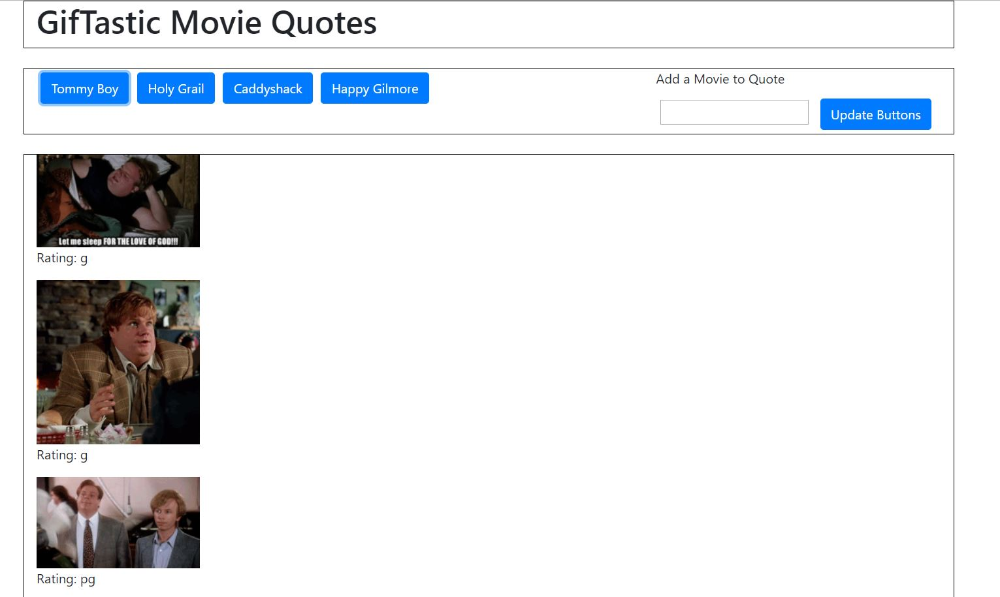

# GifTastic
Utilizing the GiphyAPI click on buttons to display gif's of a given topic

## Contributors
@boogeybum

## Technology
* Bootstrap, HTML5, CSS, JavaScript, jQuery
* Live demo: https://boogeybum.github.io/GifTastic/

## About
* The GifTastic website allows the user to click on one of the predefined buttons, or the user can create their own by entering different movie names, to see up to 10 different gifs based on the movie title enterend  

## License 
* No license explicite or implied.

## How-to use this code
* In a web browser, select a button to reveal up to 10 different gif's. 
* Clicking on the gif's that return from the search to start and stop playback.
* Users can also add new buttons to search with by entering mobie titles in the input field.

## Contributing Guidelines
All contributions and suggestions are welcome!
For direct contributions, please fork the repository and file a pull request. 

## Contact
#### Developer/Full-stack Web Software Developer (in training)
* Homepage: https://boogeybum.github.io/Bootstrap-Portfolio/
* e-mail: cseastrand@gmail.com
* Twitter: @cseastrand
* LinkedIn: https://www.linkedin.com/in/clayton-seastrand-43a76861/
